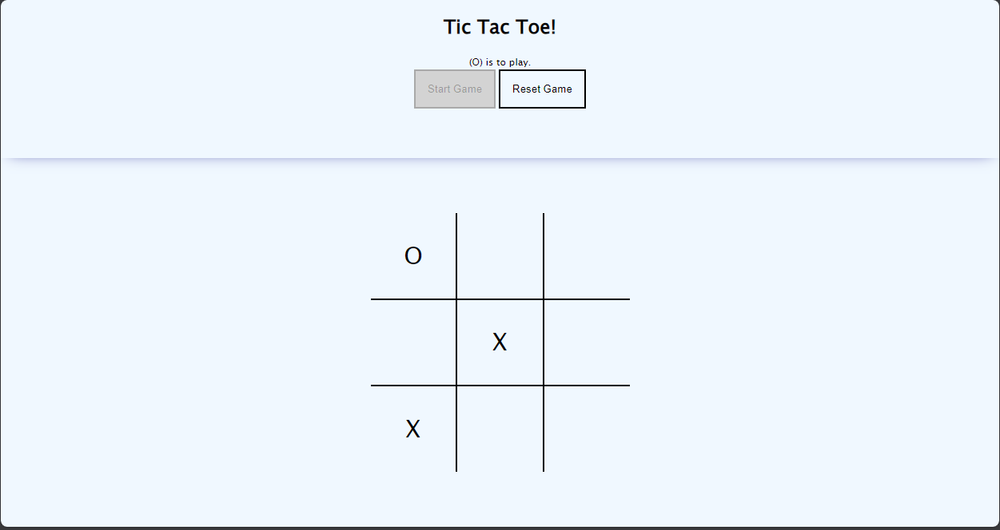

# Tic Tac Toe Game Documentation

This is a submission for the [TicTacToe Project on The Odin Project's JavaScript Course](https://www.theodinproject.com/lessons/node-path-javascript-tic-tac-toe). 



## Overview

Welcome to my Tic Tac Toe game! This project is a simple implementation of the classic Tic Tac Toe game using HTML, CSS, and JavaScript. As a junior developer, I aimed to showcase my understanding of fundamental programming concepts such as encapsulation, factory functions, DOM manipulation, and Immediately Invoked Function Expressions (IIFE).

## Game Features

- **Player vs Player**: Play against a friend and take turns marking the spaces on the board.
- **Interactive Interface**: Enjoy a user-friendly interface that responds to your clicks, making the gameplay intuitive.
- **Winning Logic**: The game automatically checks for a winner after each move and declares the result.

## Project Structure

- **HTML**: The structure of the game board and user interface.
- **CSS**: Styling to enhance the visual appeal of the game.
- **JavaScript**: The game's logic and functionality.

## Concepts Demonstrated

1. **Encapsulation**: The game logic is encapsulated within functions and classes to maintain a clean and organized codebase.

2. **Factory Functions**: Factory functions are employed to create instances of the game and manage the state of each player.

3. **DOM Manipulation**: JavaScript is used to dynamically manipulate the Document Object Model (DOM), updating the UI based on user interactions.

4. **IIFE's (Immediately Invoked Function Expressions)**: IIFE's are leveraged to create private scopes for certain functions, preventing variable conflicts and promoting modular code.

## How to Play

### Get a local copy

1. Clone the repository to your local machine.
   ```bash
   git clone https://github.com/your-username/tic-tac-toe.git
   ```

2. Open the `index.html` file in your web browser.

3. Click on the squares to make your moves and enjoy the game!

### View live site

Alternatively, you can play on the [live site](https://theavocadocoder.github.io/odin_tic-tac-toe/)

## About Me

I am a junior developer passionate about creating interactive and engaging web applications. This project reflects my ongoing learning journey and commitment to mastering essential programming concepts.

Feel free to reach out if you have any questions or suggestions for improvement!

Happy gaming! 🎮
